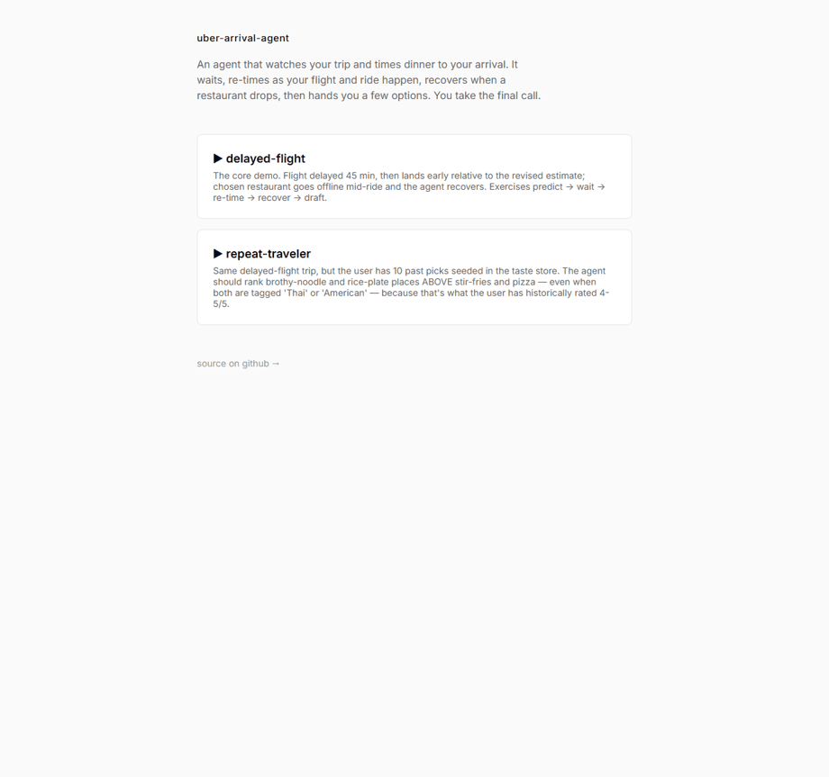

# Uber Arrival Agent

An agent at the seam between **Travel Mode** and **Eats**. You're flying somewhere
and you'll land late. It watches your trip, predicts when you'll reach your hotel
room, finds food that's actually open, and at the right moment hands you two or
three meaningfully different options. You take the final call by picking one — the
agent does everything else.



*Above: the agent waits while its arrival estimate is loose, surfaces a choice set
once the timing is tight, and recovers live when a restaurant goes offline (watch the
cards change — a dead option is dropped and a backup backfilled).*

> **Live demo:** `https://<your-app>.fly.dev` — deploy with `fly deploy` (see
> [Run it](#run-it)). The public demo replays recorded responses, so it's free,
> deterministic, and needs no API keys.

---

## Why it's an agent, not a notification

A notification says *"you might be hungry."* This shows up with a resolved, timed,
supply-checked order. The value is everything *behind* the prompt being already
solved: arrival prediction, supply check, continuous re-timing, and recovery when a
restaurant drops.

The hard part — and the genuinely agentic part — is **knowing when not to act.** When
the ride starts, the agent has a tight arrival estimate but still *waits*, because
ordering then would land food at the front desk while you're in transit. It surfaces
only once the timing is right. And its most agentic single decision isn't picking a
restaurant — it's **designing the choice set**: which *axis* the 2-3 options should
vary along (cuisine vs speed-vs-quality vs familiarity-vs-novelty), chosen for this
user at this moment. Picking one restaurant out of fifty is search. Picking three that
vary along an axis that matters is judgment.

---

## Run it

Locally, against live APIs (needs your own keys):

```bash
cp .env.example .env          # add FOURSQUARE_API_KEY, MAPS_API_KEY (Mapbox), ANTHROPIC_API_KEY
pip install -e ".[taste]"     # core + the taste store (sentence-transformers)
python -m uvicorn arrival_agent.web.server:app --port 8077
# open http://127.0.0.1:8077
```

Or drive a scenario in the terminal and watch every decision:

```bash
python -m arrival_agent.cli --scenario delayed-flight
```

**Record once, replay free forever.** The public demo serves recorded API + LLM
responses — no quota, no keys, deterministic:

```bash
ARRIVAL_AGENT_CACHE=record python -m arrival_agent.cli --scenario delayed-flight   # capture (real keys)
ARRIVAL_AGENT_CACHE=replay python -m arrival_agent.cli --scenario delayed-flight   # replay (no network)
```

Deploy (Fly.io, scales to zero so it costs nothing idle):

```bash
fly launch --copy-config --no-deploy   # may ask for a unique app name
fly deploy
```

---

## How it works

A framework-agnostic **core** (the agent's reasoning + tools) with thin **adapters**
that wrap it in an orchestration framework — so the same agent can run on, and be
compared across, different frameworks.

```
src/arrival_agent/
  core/
    contract.py     the agent-loop contract every adapter implements
    events.py       event model: trip booked, flight status, ride started/ended,
                    order rejected, check-in, user pick
    tools/          eta (Mapbox), restaurants (Foursquare), flight + orders (mocked)
    domain/         the reasoning — pure, no I/O:
      retiming.py     predict room arrival; the wait-vs-act rule
      envelope.py     the user's one-time curation policy
      recovery.py     restaurant-offline + no-supply fallbacks
      choice_set.py   the single LLM call: pick the axis, design 2-3 options
      taste.py        per-user vector store ranking past picks (cosine, local)
    cache.py        record/replay so the demo is free + deterministic
  adapters/
    langgraph/      primary: StateGraph + checkpointer + a native interrupt at
                    the choice moment
  web/              FastAPI + SSE — stream the agent's reasoning to the browser
scenarios/          mock event timelines (+ recorded cache/ for replay)
```

The loop, on the LangGraph adapter:

```
  trip event ─▶ predict arrival ─▶ wait?  ─yes─▶ END (persist, sleep till next event)
                                     │no
                                     ▼
                  curate (Foursquare + taste) ─▶ design choice set (LLM)
                                     │
                                     ▼
                    ★ interrupt: surface options, wait for the pick ★
                                     │
                  order_rejected ──▶ recover (drop dead option, backfill) ─┐
                                     │                                       │
                       user picks ──▶ place order ─▶ END        ◀───────────┘
```

LangGraph fits because the trip is **long-running, event-driven, and stateful**, with
a **human in the loop at one specific moment** — "wait for the ride, then re-decide"
is a graph transition, and "surface the choice set and wait for the pick" is a native
interrupt. (The raw-loop and naive-baseline adapters, plus a side-by-side metrics
comparison, are the next phase — see [`docs/framework-comparison.md`](docs/framework-comparison.md).)

---

## Stack

- **LangGraph** — orchestration: graph state, checkpointing, interrupts
- **Foursquare Places API** — open restaurants + hours near the hotel
- **Mapbox** — airport → hotel ETA
- **Anthropic Claude** — the choice-set reasoning (one structured tool-use call)
- **sentence-transformers + numpy** — the per-user taste store (local, no API)
- **FastAPI + SSE** — streaming the agent's reasoning to the browser
- Flight status and order placement are **mocked** — flight APIs are flaky, and
  there is no public Uber Eats consumer API. Honest constraints, not shortcuts.

See [`DESIGN.md`](./DESIGN.md) for the full design and the decisions behind it.
